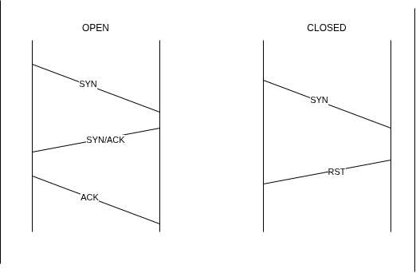
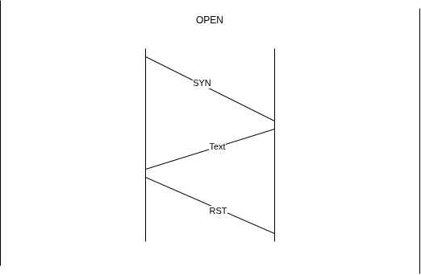

# PORT SCANNING WITH NMAP
## Functions of nmap
- **Auditig security aspects of networks**
- **Simulating Penetration Tests**
- **Checking Firewalls and IDS  Settings and Configurations**
- **Types of possible connections**
- **Network Mapping**
- **Response Analysis**
- **Identify open ports**
- **Vulnurability Assesment**

## Nmap Architecture

1. Host Scanning 
2. Port Scaning 
3. Service Enumeration& Detection 
4. OS Detection 
5. Scriptable Interactions with the target services

##  Scan Types

1. TCP Connect Scan `(-sT)`

---
2. SYN Half-Open Scan `(-sS)`

---
3. UDP Scan `(-sU)`
4. TCP Null Scan `(-SN)`
5. TCP FIN Scan `(-sF)`
6. TCP Xmas Scan `(-sX)`

## Port States
OPEN 
CLOSED 
FILTERED 
UNFILTERED 

## Projects
port-connector.py